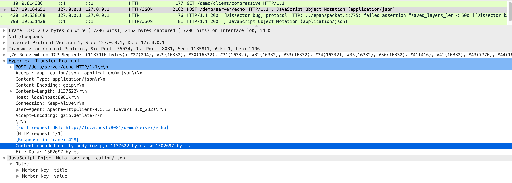
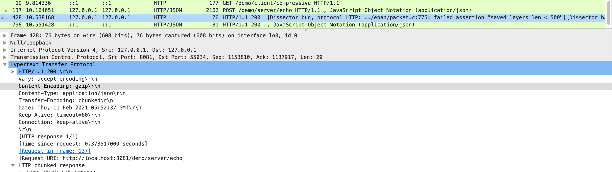
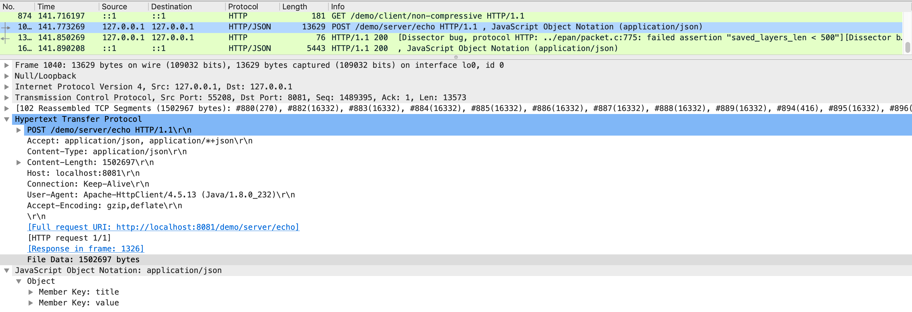

# gzip_demo
Reducing JSON Data Size

### Compressing Requests Using the Spring RestTemplate
I created ClientHttpRequestInterceptor to modify the request.

```kotlin
override fun intercept(request: HttpRequest, body: ByteArray, exec: ClientHttpRequestExecution): ClientHttpResponse {
    request.headers.add(HttpHeaders.CONTENT_ENCODING, "gzip")
    return exec.execute(request, compress(body))
}
```
Here is the method to compress a ByteArray.
```kotlin
private fun compress(body: ByteArray): ByteArray {
    val stream = ByteArrayOutputStream()
    GZIPOutputStream(stream).use { it.write(body) }
    return stream.toByteArray()
}
```

It is need to write your own filter to unzip body of gzipped requests.
```kotlin
@Service
class GzipRequestFilter : Filter {
    companion object {
        private const val GZIP_ENCODING = "gzip"
    }

    override fun doFilter(request: ServletRequest, response: ServletResponse, chain: FilterChain) {
        if (request is HttpServletRequest) {
            val contentEncoding = request.getHeader(HttpHeaders.CONTENT_ENCODING)
            if (contentEncoding.isNotEmpty() && contentEncoding.indexOf(GZIP_ENCODING) >= 0) {
                chain.doFilter(decompressedRequest(request), response)
                return
            }
        }
        chain.doFilter(request, response)
    }


    private fun decompressedRequest(httpServletRequest: HttpServletRequest): HttpServletRequestWrapper {
        val gzipInputStream = GZIPInputStream(httpServletRequest.inputStream)

        return object : HttpServletRequestWrapper(httpServletRequest) {
            override fun getInputStream() = DecompressedServletInputStream(gzipInputStream)

            override fun getReader() = BufferedReader(InputStreamReader(gzipInputStream))
        }
    }    
}
```

```kotlin
class DecompressedServletInputStream(private val inputStream: InputStream) : ServletInputStream() {
    override fun setReadListener(readListener: ReadListener) { }

    override fun isFinished() = inputStream.available() == 0

    override fun read() = inputStream.read()

    override fun isReady() = inputStream.available() > 0
}
```

### Enable response compression

##### Server-Side
It is enable to compress response by setting below parameters in application.yml file.
```yaml
server:
  compression:
    enabled: true
    mime-types: text/html,text/plain,text/css,application/javascript,application/json
    min-response-size: 1024
```

`server.compression.mime-types`:<br>
list of MIME types that should be compressed.

`server.compression.min-response-size`:<br> 
minimum "Content-Length" value that should be compressed.<br>This is because if I compress small data, may be bigger than the original.

##### Cliennt-Side
It is need to replace the default requestFactory with one from Apache HttpClient.
```kotlin
implementation("org.apache.httpcomponents:httpclient:4.5.13")
```

```kotlin
val httpClient = HttpClientBuilder.create().build()
val clientHttpRequestFactory = HttpComponentsClientHttpRequestFactory(httpClient)
return RestTemplate(clientHttpRequestFactory)
```

### Capture
The request is compressed to 1137622 bytes from 1502697 bytes.


The response is also compressed.


Here is capture of non-compressive request.

